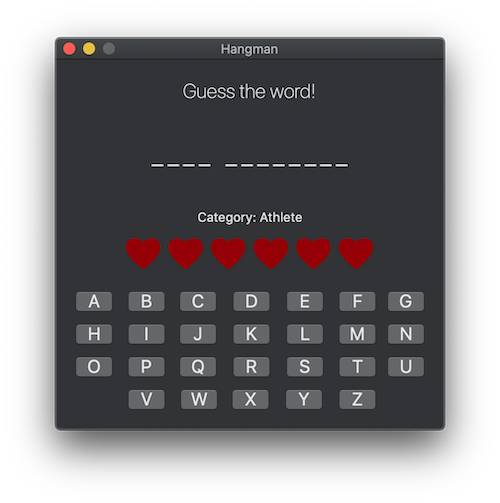
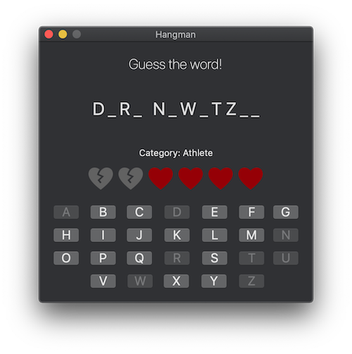
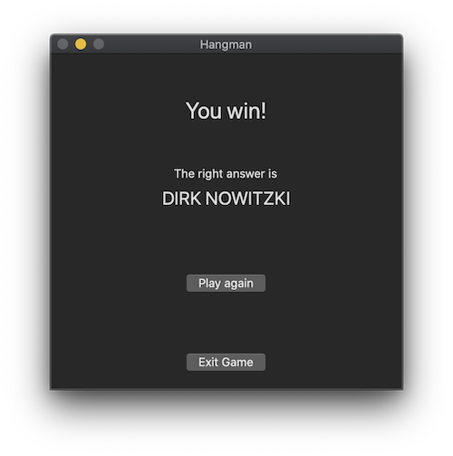

#  Hangman

This is a simple Hangman game for macOS made with Swift and AppKit.

## Screenshots

## Game instructions

The player has six lives.  
The player loses one life when he chooses a letter that is not contained in the word to be guessed.  
The player loses the game when he runs out of lives.  
The player wins the game when he reveals all the letters in the word to guess before he runs out of lives.  

## License

Distributed under the MIT License. See `LICENSE` for more information.

## Acknowledgements

The heart icons are from Clarity Design System made by VMWare.  
Clarity is licensed under the MIT License.  
https://clarity.design/icons
